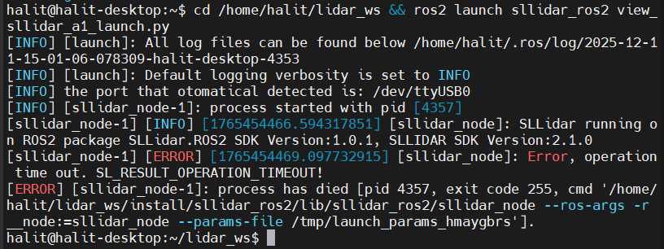

the codes that you will run to launch program
(5 terminal in wsl, 2 terminal in windows, 3 terminal in raspbery)
raspbery nin ip'sine göre değiştirmeniz gereken yerler:
odometry_tools.py 9. satır
raspbery ile ilk bağlantıyı sağlamak amacıyla

programı kullanırken kullanılacak portlar:
5006 portunu wsl ile windows arasında teleop verisinin aktarımında kullanıyoruz
5005 portunu windows ile raspbery arasındaki teleop verisinin aktarımında kullanıyoruz
5007 portunu wsl ile windows arasındaki lidar verisinin aktarımında kullanıyoruz
5008 portunu windowsi le raspbery arasındaki lidar verisinin aktarımında kullanıyoruz

motor sürücü kartı id sıkıntısı için:
raspbery deki set_rpm.py dosyası içerisindeki 46. ve 47. satırlar

1. Main programı çalıştırma
    1.1. wsl de -> 
        cd ~/acrome_mini_robot
        colcon build --packages-select set_slam
        source install/setup.bash
        ros2 launch set_slam display.launch.py

2. Lidar verisini wsl de /scan topic i altında yayınlatma

    2.1. wsl de -> cd ~/acrome_mini_robot && ros2 run publish_lidar get_scan_from_raspbery
    (sudo fuser -k 5007/tcp) bu kod gerekebilir

    2.2. windowsta -> lidar_tools.py adlı dosya başlatılacak

    2.3. raspbery -> cd /home/halit/set_slam_ws && ros2 run lidar_pkg get_lidar

    2.4. raspbery -> cd /home/halit/lidar_ws && ros2 launch sllidar_ros2 view_sllidar_a1_launch.py
 bu hatayı alırsanız lidarın takılı olduğu usb portunu değiştirip tekrar deneyin

    2.5. wsl de -> cd ~/acrome_mini_robot && ros2 run publish_lidar publish_synchronous

3. Odometry verisini wsl de /odom topic i altında yayınlatma

    1.1. wsl de -> python3 /home/halit/acrome_mini_robot/src/set_slam/set_slam/launch/teleop.py

    1.2. windowsta -> odometry_tools.py adlı dosya çalıştırılacak

    1.3. raspbery de -> cd /home/halit/set_slam_ws && sudo -E python3 set_rpm.py

4. New terminal
ros2 lifecycle set /slam_toolbox configure
ros2 lifecycle set /slam_toolbox activate
ros2 lifecycle get /slam_toolbox
(node not found) hatası verirse son 3 kodu tekrardan çalıştır